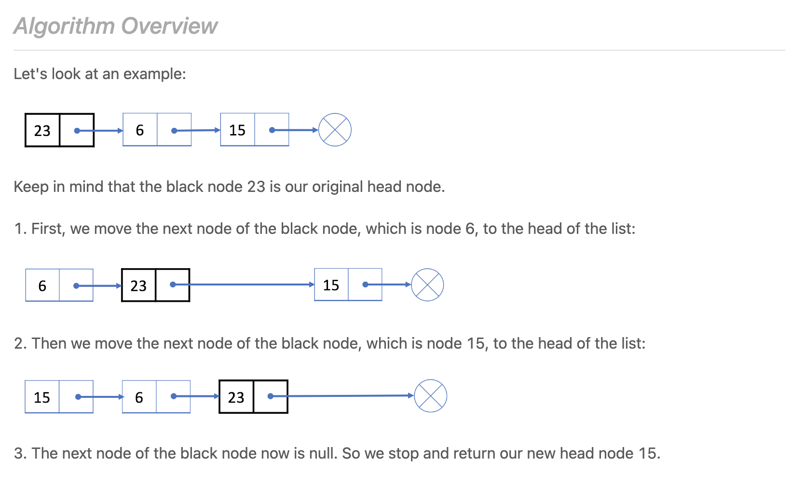

# Notes

## p206_reverse-linked-list.c
`Method 1`

`Method 2`

## p142_linked-list-cycle-ii
### The idea in the discussion, Consider `floyd's Cycle`

1-->2-->3-->4-->5-->6-->7-->8-->9-->Back to 4

I<-----a----->I<---b--->I<-------c------->|

* Let a be the distance from the head to the start of the cycle at 4
* b is the distance from the start of the cycle to the intersection point of fast and slow pointers i.e at 6
* c is the distance from the intersection till the start of the cycle at 4

2* slower pointer travel distance = fatser pointer travel distance in the same period of time.

`2 * (a + b) = a + (b + c) + b`; where the first 2 is because the faster pointer (runner) is 2 times fater than smaller pointer (walker).

Then from this we get a = c;

No, this is wrong.

The reason is these answers are assuming the runner will run **ONLY** one round of circle (b + c) then meet walker. However, if the circle is really small, it is posible that the runner has to run multiple rounds in circle to meet with the walker (just try to imagine a = 10, b = 1, c = 1).

Considering this, the correct equation is actually
`2 * (a + b) = a + K*(b + c) + b`, where K is an integer, K is the number of full rounds runner has to run in circle before he meets walker. When circle is really small, K can be bigger than 1.

Based on this, we can simplify it to

`a + b = K*(b + c)`

Further

`a = (K - 1) * b + K*c`

If we claim N = (K - 1), so N is also an integer, then

`a = N * b + (N + 1)* c;`

or

*a = c + N (b + c)*

So what does this tell us? In `c + N * (b + c)`, c is just the original walker keeps walking after he meets with runner, and after walking for c, he is back to the circle beginning. And N*(b + c) is just this walker keeps walking FULL rounds in circle.

This equals to a, this means when another walker (let's say walker 2) starts at the beginning of this linked list, and when he walks for `a` and reach the circle beginning, walker 1 just finished one round of walk in circle and they meet.

So they meet at the circle beginning. This is why after walker and runner meets, we get another walker to start at the linked list beginning, and let walker 1 and 2 start walking, and when walker 1 and 2 meets, they meet at the circle beginning.